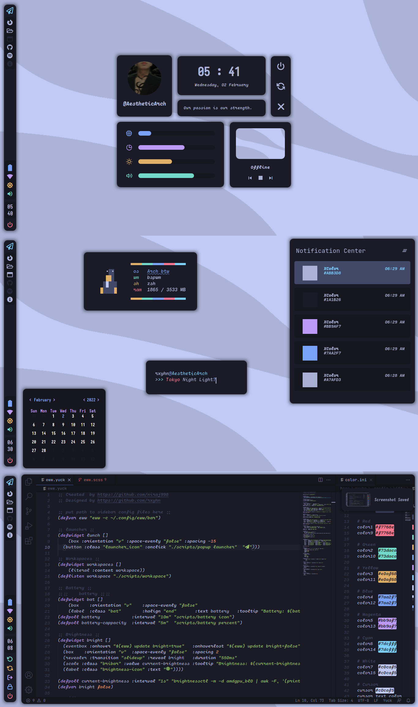

<h1 align="center"> ━━━━━━  ❖  ━━━━━━ </h1>

    

    
    
    
   

---

<!-- INFORMATION -->
# ❖ Information 

## Required
- [BSPWM](https://github.com/baskerville/bspwm)
- [Ibhagwan Forked Picom](https://github.com/ibhagwan/picom)
- [Cartograph CF](https://coding-fonts.css-tricks.com/fonts/cartograph-cf/)
- [Iosevka](https://github.com/be5invis/Iosevka)

## Screenshot

## Thanks To
- [niraj](https://github.com/niraj998)

